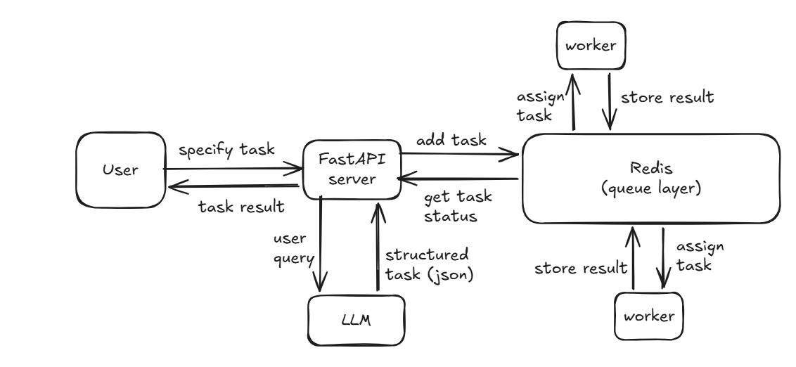

A distributed task execution system that converts natural language into structured tasks using an LLM, and executes them asynchronously via a Redis-backed worker queue.

## Features
- Distributed task execution using Redis
- Priority-based scheduling
- Retry with failure handling
- LLM-based task generation (natural language -> tasks)
- Web scraping + market data ingestion

## Run locally
- uvicorn api.main:app
- python -m worker.worker